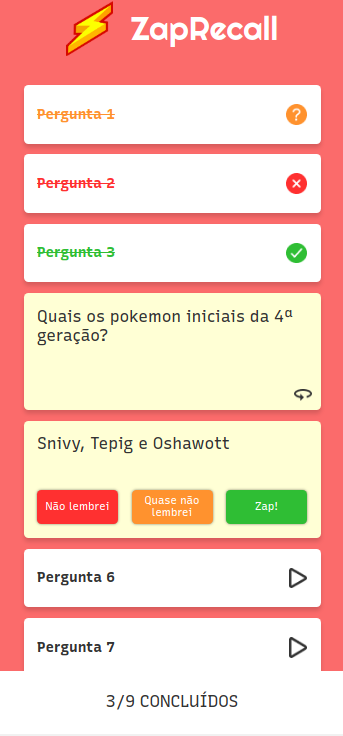

# 
 Projeto Instagram React

 

 

## ✏️ Description

A game that give you a hidden word for you to discover it, choosing letters and guessing the word. If you choose six wrong letters, the game ends and you loose.  The feedback for wrong letters and for game over comes throw images from a hanguing dummy.

 

##  
 :white_circle: Tecnologias

- [HTML](https://developer.mozilla.org/pt-BR/docs/Web/HTML)
- [CSS](https://www.w3schools.com/css/)
- [JavaScript](https://developer.mozilla.org/pt-BR/docs/Web/JavaScript)
- [React](https://reactjs.org/)

 
